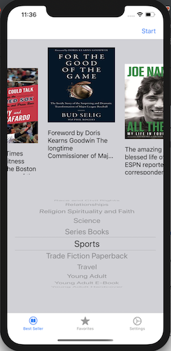
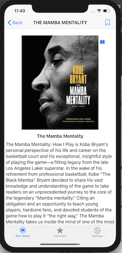
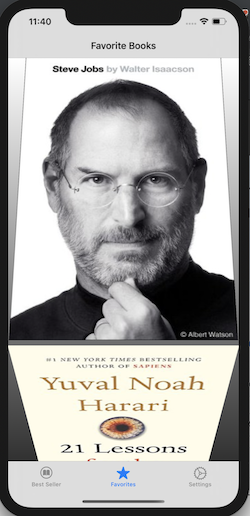

# New York Times Best Seller Lists App

## Contributors
##### Margiett Gil - https://github.com/Margiett
##### Tsering Lama - https://github.com/tseringlamanyc
##### Kelby Mittan - https://github.com/kelby-mittan
##### Luba Kaper

## Description

This application allows for a user to use a picker view or speech recognition to filter out and present a custom collection view of The New York Times' best sellers lists based by category.
The user can then segue to a detail view controller where a summary of the selected book is given and is allowed to favorite the book
as well as tap a button that drops down a list of links where the book can be purchased. Finally the favorites list is a collection 
view of books that the user can scroll through and is allowed to segue to a safari page for the book's NYT review or Google preview via a custom 
alert controller.

## ScreenShot of App





##  GIF's


## Code Snippets

### Speech Recognition
```swift
private func getSpeech() {
        let node = audioEngine.inputNode  // nodes to process bits of audio, singleton of incoming audio
        let recordingFormat = node.outputFormat(forBus: 0)
        node.installTap(onBus: 0, bufferSize: 1024, format: recordingFormat) { buffer, _ in
            self.request.append(buffer)
        }
        audioEngine.prepare()
        
        // for error checking
        do {
            try audioEngine.start()
            print("im listening")
        } catch {
            return print("\(error)")
        }
        guard let myRecognizer = SFSpeechRecognizer() else { // recognizer for locale
            return // not supported
        }
        if !myRecognizer.isAvailable {
            // recognizer not avaliable
            return print("not available")
        }
        recognitionTask = speechRecognizer?.recognitionTask(with: request, resultHandler: { [weak self] (result, error) in
            if result != nil {
                if let result = result {
                    // This is where the recognition happens
                    let userString = result.bestTranscription.formattedString
                    // This string value will show all of the words that have been said and recognized so far
                    self?.navigationItem.title = userString
                    self?.nowBook = userString
                    if let index = self?.sections.firstIndex(of: userString) {
                        self?.bestSellerView.pickerView.selectRow(index, inComponent: 0, animated: true)
                    }
                } else if let error = error {
                    print(error)
                }
            }
        })
    }
```
### Custom alert window   
```swift
    
     @IBAction func linkButton(sender: UIButton) {
        let appearance = SCLAlertView.SCLAppearance(
            kCircleBackgroundTopPosition: 0,
            kCircleHeight: 100,
            kCircleIconHeight: 80,
            showCircularIcon: true,
            circleBackgroundColor: .clear
        )

        let alertView = SCLAlertView(appearance: appearance)

        alertView.addButton("NYT Review") { [weak self] in
            print("first button")
            let nytWebString = self?.selectedBook.bookReviewLink
            guard let url = URL(string: nytWebString ?? "") else {
                if nytWebString == "" {
                    self?.showAlert(title: "Sorry", message: "The New York Times has yet to review this book.")
                }
                return
            }
            let safariNYTVC = SFSafariViewController(url: url)
            self?.present(safariNYTVC, animated: true)
        }
        alertView.addButton("Preview on Google") { [weak self] in
            let googleWebString = self?.googleBooks.first?.volumeInfo.previewLink
            guard let url = URL(string: googleWebString ?? "") else {
                if googleWebString == "" {
                    self?.showAlert(title: "Sorry", message: "There is no preview of this book available on Google Books.")
                }
                return
            }
            let safariNYTVC = SFSafariViewController(url: url)
            self?.present(safariNYTVC, animated: true)
        }
        let image = UIImage.gif(name: "bookGIF2")!
        let title = selectedBook.title

        alertView.showCustom("  ", subTitle: "\(title )", color: .gray, icon: image)
        
    }
```
## Cocoa Pods Used
#### Gemini Cell - Shohei Yokoyama - https://github.com/shoheiyokoyama/Gemini
#### SCLAlert - Viktor Radchenko - https://github.com/vikmeup/SCLAlertView-Swift

