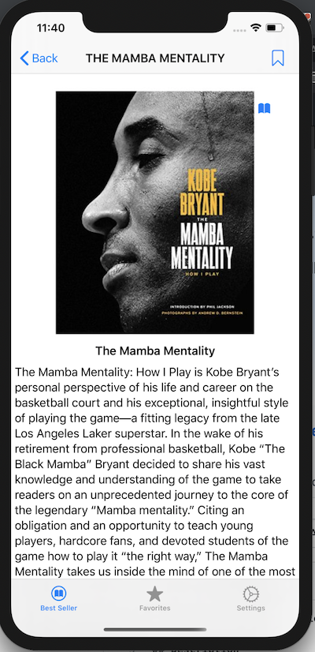

# New York Times Best Seller Lists App

## Description

This application allows for a user to use a picker view or speech recognition to filter out and present a custom collection view of The New York Times' best sellers lists based by category.
The user can then segue to a detail view controller where a summary of the selected book is given and is allowed to favorite the book
as well as tap a button that drops down a list of links where the book can be purchased. Finally the favorites list is a collection 
view of books that the user can scroll through and is allowed to segue to a safari page for the book's NYT review or Google preview via a custom 
alert controller.

## ScreenShot of App

##  GIF's

